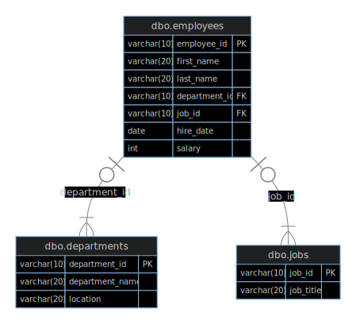

# HR Database SQL

This repository contains SQL scripts and exercises for a simulated Human Resources (HR) database. It is designed for SQL beginners and intermediate learners to practice schema creation, data insertion, and query writing using a realistic HR scenario.

## 📁 Contents

- **Schemas.sql**  
  SQL statements to create the HR database tables (`employees`, `departments`, `jobs`).

- **Insert_Queries.sql**  
  Sample data to populate the tables with employees, departments, and jobs.

- **Exercises.sql**  
  Practice SQL questions and sample queries covering SELECT, JOIN, GROUP BY, filtering, and aggregation.

## 🏗️ Database Structure

The HR database consists of three main tables:

- **employees:** Employee details (name, department, job, hire date, salary, etc.)
- **departments:** List of departments and their locations.
- **jobs:** List of job titles.

### Table Relationships

- Each employee belongs to one department and has one job.
- Departments and jobs can have multiple employees.
- **Primary Keys (PK):** Each table has a unique primary key (`employee_id`, `department_id`, `job_id`).
- **Foreign Keys (FK):**  
  - `department_id` in `employees` references `departments`.
  - `job_id` in `employees` references `jobs`.



## 🚀 Getting Started


### 1. Clone This Repo

```sh
git clone https://github.com/blvckjoy/hr-database-sql.git
cd hr-database-sql
```

### 2. Create the Database Tables

Run the commands in `Schemas.sql` to create the tables.

### 3. Insert Sample Data

Run the commands in `Insert_Queries.sql` to populate the tables.

### 4. Practice SQL

Try the queries in `Exercises.sql` or write your own!

## Requirements

- SQL Server or compatible database system that supports T-SQL.

## 💡 Example Practice Questions

- List all employees and their job titles.
- Show each employee’s name, department, and job title.
- Display the total number of employees in each department.
- Find all employees who are managers.
- Count employees hired in each year.

(See `Exercises.sql` for more!)

## 📄 License

This project is open-source and free to use for learning and personal projects.

---

Happy querying! 🚀
